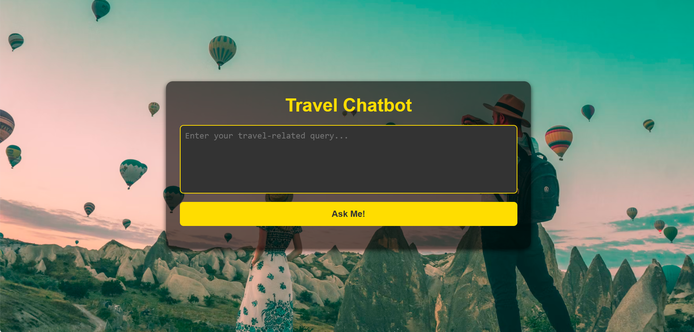

# Travel Chatbot

A travel-themed chatbot that uses the power of Gemini AI to provide insightful, AI-generated responses for your travel queries. It utilizes dynamic background images, smooth transitions, and formatted responses to create a visually appealing and interactive user experience.
This project was prepared using a No Code approach, leveraging generative AI tools like ChatGPT and GeminiAI for rapid development and implementation.

## Features
- **AI-Powered**: Built using **Gemini AI** to answer travel-related questions.
- **Dynamic Backgrounds**: Background images change periodically, with smooth transitions.
- **Formatted Responses**: Responses from the AI are displayed with proper HTML formatting (bold, italics, links, etc.).
- **Responsive Design**: The app adapts to various screen sizes, making it suitable for desktop and mobile use.
- **Loading State**: Displays a loading message while the AI is processing your query.

## Technologies Used

- **React**: For building the user interface.
- **Gemini AI**: For generating travel-related responses.
- **CSS**: Custom styling for a clean, modern look.
- **Unsplash API**: For dynamically changing background images.

## How It Works

1. **User Input**: Enter a travel-related query in the text box and click "Ask Me!".
2. **AI Processing**: The query is sent to the Gemini AI model (`gemini-1.5-flash-latest`), which generates a response based on the input.
3. **Response Display**: The response is formatted with HTML for bold, italics, and links, and is shown in the response box.
4. **Background Transitions**: The background images cycle every 30 seconds with a smooth fade-in/out transition.

## Demo




#### You can view a demo of the chatbot in action here:

https://github.com/user-attachments/assets/e45427e0-2f8e-4884-9f77-d3d8cd8e493e


## Installation

1. Clone the repository:
    ```bash
    git clone https://github.com/your-username/travel-chatbot.git
    ```

2. Install dependencies:
    ```bash
    cd travel-chatbot
    npm install
    ```

3. Set up your API key for Gemini AI:
    - Create a `.env` file at the root of the project.
    - Add your API key:
      ```
      REACT_APP_GEMINI_API_KEY=your-api-key-here
      ```

4. Run the application:
    ```bash
    npm start
    ```

5. Open the app in your browser:
    ```bash
    http://localhost:3000
    ```


## License

This project is licensed under the MIT License.

